

  

## Une console portable basée sur Arduino Due
Notre projet est de créer une console portable basée sur Arduino Due. Elle sera notamment équipée d’un écran `LCD TFT`, d’un lecteur de carte micro `SD`, d’un haut-parleur, d’un gyroscope, d’un module bluetooth… De plus, elle devrait posséder une interface permettant de lancer plusieurs jeux et applications.

## Séance 1 : 14/12/18
Notre premier soucis a été de trouver un écran ayant une fréquence de rafraîchissement assez grande. En effet, dans le cadre des jeux vidéo, la fréquence de rafraîchissement est primordiale pour un affichage correct et des transitions fluides.

### Écran TFT à 8 bits en parallèle

  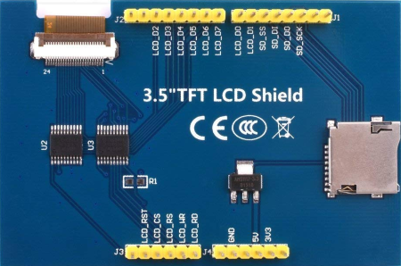

Nous avons tout d’abord opté pour un écran `LCD TFT` (*Thin-Film Transistor*) ayant 5 pins de contrôle, 8 pins de communication et un contrôleur `ILI9486`.

En effet, nous pensions, à prime abord, que le nombre de pins de communication impacterait grandement la fréquence de rafraîchissement de l’écran.

Cependant, après quelques tests, nous avons constaté que l’écran pouvait prendre jusqu’à deux minutes pour rafraîchir individuellement chaque pixel avec une couleur aléatoire.

### Écran TFT à liaison SPI

  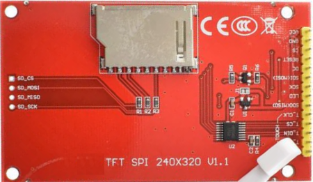

Nous avons alors opté pour un écran `LCD TFT` à liaison `SPI` (*Serial Peripheral Interface*) qui n’utilise que 3 pins de contrôle, 4 pins de communication et un contrôleur `ILI9341`. L’avantage de la liaison `SPI` est son débit de données bien plus important notamment en mode `DMA` (*Direct Memory Access*).

De plus, après quelques recherches, nous avons trouvé une bibliothèque [ILI9341_due](https://github.com/marekburiak/ILI9341_due) très complète conçue pour notre contrôleur d'écran et pour Arduino Due. Cette bibliothèque correspond parfaitement à notre projet et implémente d'ores et déjà des fonctions d'affichage indispensables.

Après quelques tests, nous parvenons à afficher des textes, des formes et des images et à les animer. Cependant, nous avons toujours affaire à quelques artéfacts d'affichage qui sont dû à la fréquence de rafraîchissement de l’écran que nous devons prendre en compte.

## Séance 2 : 18/12/18
Nous nous répartissons les tâches et je décide d'attaquer la gestion de la mémoire. En effet, toujours dans le cadre des jeux vidéo, un de nos plus gros soucis sera le stockage et l'accès aux ressources telles que les images et les sons.

Nous décidons d'utiliser pour cela un module de carte micro `SD` à liaison `SPI`. En effet, la mémoire `SRAM` et `FLASH` offerte par l'Arduino Due n'est pas suffisante pour stocker toutes les ressources. De plus, cela nous permettra de stocker les ressources de tous les jeux sans avoir à reflasher l'Arduino Due.

### Module carte micro SD

  

Après quelques recherches, je dois choisir entre deux bibliothèques de gestion de carte `SD` pour Arduino. La première bibliothèque [SD](https://www.arduino.cc/en/Reference/SD) est celle fournie par l'Arduino IDE. La deuxième bibliothèque [SdFat](https://github.com/greiman/SdFat) est celle que je choisis puisqu'il s'agit de la plus maintenue à jour par une communauté active. De plus, cette-denière permettrait un accès aux ressources bien plus rapide.

### Cartes micro SD

  &nbsp;
  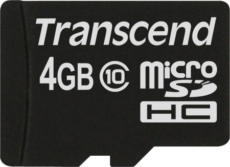

Lors des premiers tests, il est nécessaire de trouver la plus grande fréquence de fonctionnement de notre carte micro `SD`. Dans un premier temps, j'essaie une carte micro `SDHC` de 16 Go et je constate que sa fréquence de fonctionnement est très basse. En effet, il semblerait que la fréquence de fonctionnement d'une carte `SD` soit d'autant plus grande que sa capacité est faible. Je décide alors d'utiliser une carte micro `SDHC` de 4 Go pour laquelle je trouve une fréquence de fonctionnement bien plus grande.

Il est ensuite très simple d'accéder à la mémoire et de manipuler les fichiers en lecture et en écriture. J'ajoute dès à présent une fonctionnalité permettant de désactiver la communication avec l'écran `TFT`, également en liaison `SPI`, lors de l'accès à la carte `SD` afin d'éviter les conflits.

## Séance 3 : 11/01/19
Dans l'optique d'un meilleur confort de jeu, nous décidons d'utiliser des boutons à membrane au lieu de boutons poussoirs. Je dois alors chercher les boutons, les membranes en caoutchouc et le circuit imprimé permettant leur fonctionnement. Malheureusement, les boutons à membrane sont souvent vendus sans le circuit imprimé, pour permettre la réparation de vieilles manettes.

### Manette de SNES

  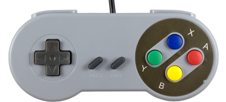

Je choisis une option assez simple qui consiste à réutiliser les composants d'une manette filaire de `SNES`.

### Composants de la manette

  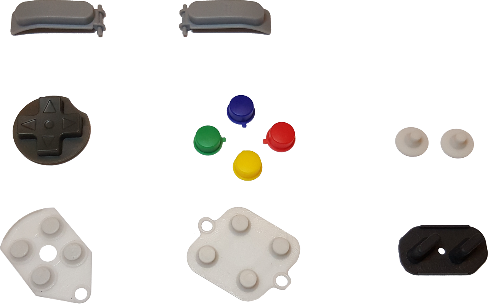

Il me suffit de démonter la manette puis de récupérer les boutons, les membranes et le circuit imprimé.

### Circuit imprimé de la manette

  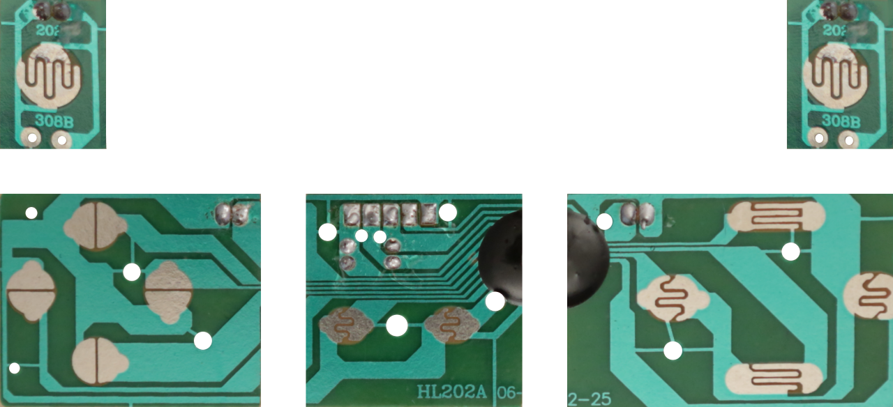

Je découpe ensuite le circuit imprimé en cinq morceaux afin de pouvoir disposer les boutons plus aisément ultérieurement.
- Un morceau pour la croix directionnelle.
- Un morceau pour les boutons `Start` et `Select`.
- Un morceau pour les boutons `A`, `B`, `X` et `Y`.
- Deux morceaux pour les gachettes gauche et droite.

### Schéma du circuit imprimé

  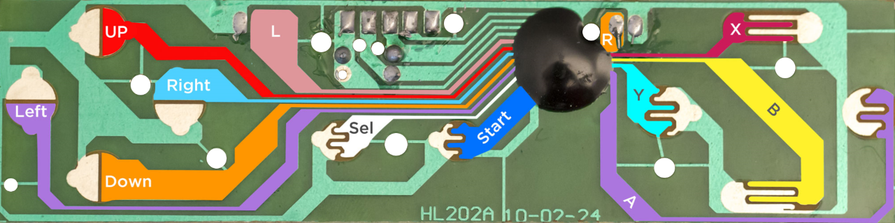

Enfin, je soude des fils sur les contacts des circuits imprimés afin de détecter la pression de chaque bouton. Pour l'instant, les fils sont suffisamment longs pour pouvoir disposer les boutons plus facilement lors du montage.

### Gestionnaire des boutons
Finalement, il ne me reste plus que le développement d'une bibliothèque permettant la gestion des boutons. Pour cela, je crée une structure de données pour pouvoir stocker toutes les informations des boutons telles que le nom, le pin, l'état, l'état précédent... etc.

Je développe ensuite une classe qui stocke tous les boutons et qui admet un certain nombre de fonctions. Ces fonctions permettent de récupérer facilement des informations utiles sur les boutons à partir de leur nom : le bouton est-il pressé ? le bouton a-t-il été relâché ? le bouton est-il pressé depuis un certain temps ? ... etc.

## Séance 4 : 18/01/19
Après ces quelques séances, nous avons déjà réussi à mettre en place la gestion de l'écran, des boutons et de la mémoire sur une carte micro `SD`. De ce fait, il nous semble important de réunir notre travail au plus vite pour valider ces fonctionnalités et aller plus loin dans le projet.

### Morpion

  

Je décide alors de coder le premier jeu simpliste de la console : un morpion ! Je commence par gérer l'affichage du jeu en utilisant les fonctions de la bibliothèque de l'écran. J'ajoute un sélecteur permettant de se déplacer et de valider son choix à l'aide des boutons à l'aide de la bibliothèque des boutons. J'implémente ensuite une vérification de victoire ou d'égalité des joueurs. Enfin, je crée un menu permettant au joueur de choisir son mode de jeu. En effet, le joueur peut choisir de jouer contre un autre joueur ou contre une intelligence artificielle simple.

### Modélisation 3D

  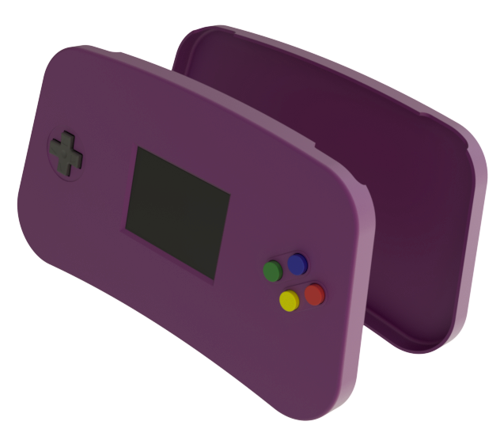

Afin d'obtenir le meilleur résultat possible, nous choisissons de faire imprimer en 3D le boitier de notre console. Pour cela, il est nécessaire de s'occuper d'ores et déjà de la modélisation 3D du boitier. J'utilise alors le logiciel <a href="https://www.autodesk.fr/products/inventor/overview">Inventor</a> pour modéliser l'intégralité des composants avec une grande précision pour un résultat au plus proche de la réalité. De plus, il est nécessaire de réfléchir à la meilleure disposition des composants pour la miniaturisation et l'ergonomie de la console.

### Quelques rendus

  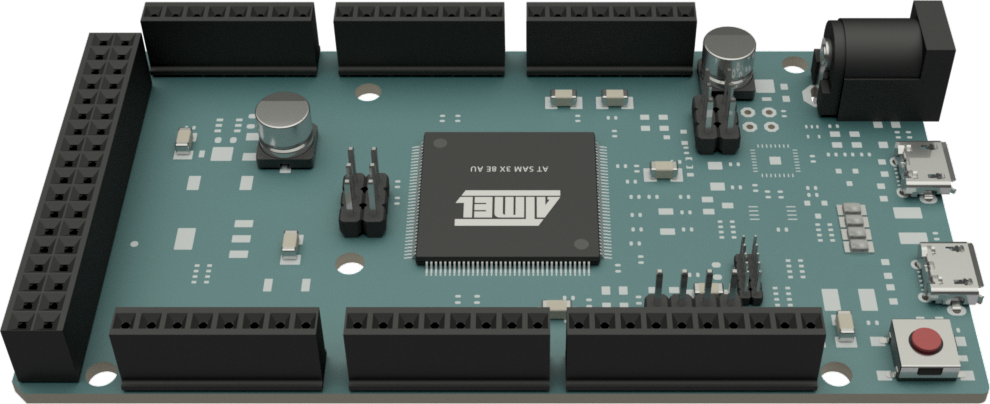&nbsp;&nbsp;
  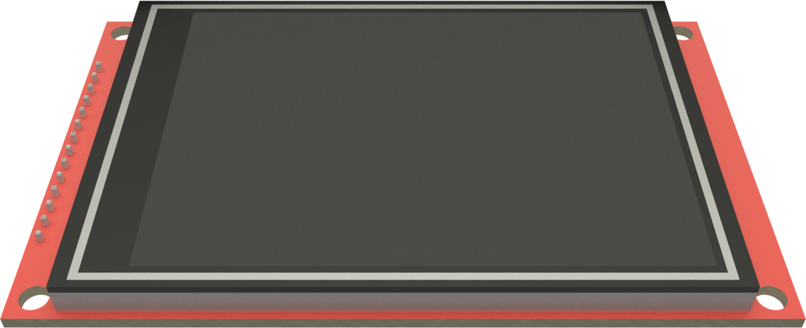&nbsp;&nbsp;
  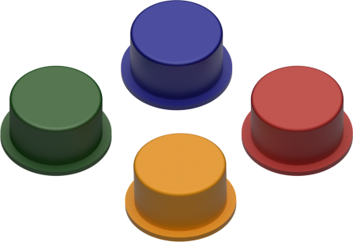&nbsp;&nbsp;
  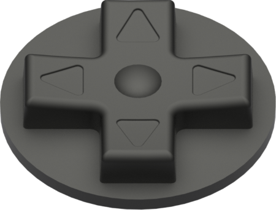&nbsp;&nbsp;
  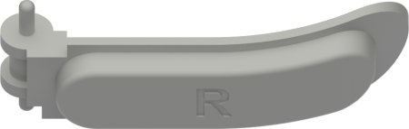&nbsp;&nbsp;
  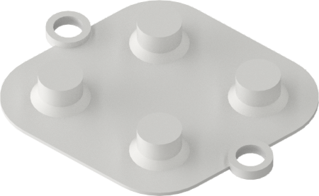&nbsp;&nbsp;
  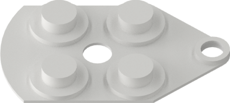&nbsp;&nbsp;
  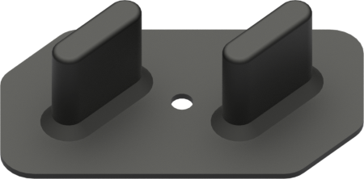

## Séance 5 : 05/02/19
Durant cette séance, je poursuis la modélisation 3D du boitier de la console. Le but est de penser au mieux la structure du boitier autant du point de vue extérieur, pour une bonne ergonomie et une certaine rigidité, que du point de vue intérieur, pour une bonne fixation des composants. De plus, je souhaite miniaturiser au maximum la console. L'enjeu est donc de taille puisque nous n'avons pas beaucoup d'espace pour les composants et plus beaucoup de temps pour réaliser des prototypes. Il s'agit alors de laisser une certaine marge à l'impression 3D pour mieux corriger et emboîter les deux parties du boitier a posteriori.

### Impression 3D

  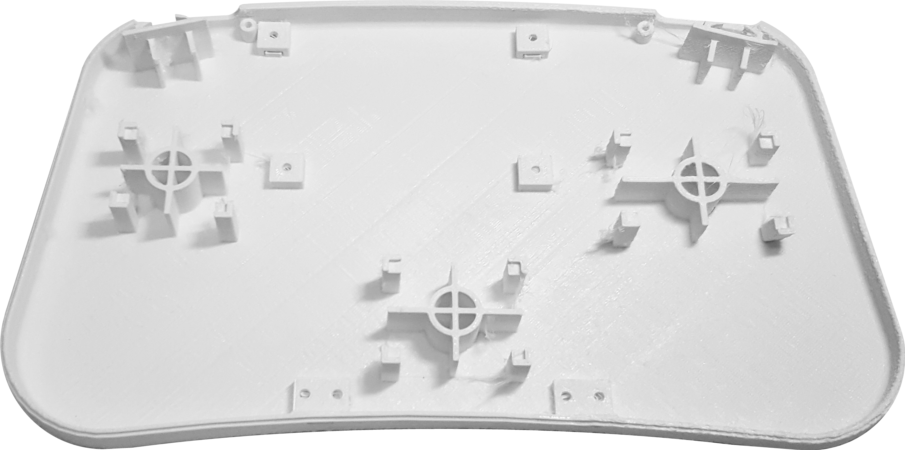

Une fois ce long processus terminé, je contacte le [SoFab](http://www.sofab.tv/), un atelier partagé de fabrication situé sur le campus Sophiatech, qui accepte notre projet d'impression 3D. Je parviens assez facilement à imprimer le bas du boitier. Cependant, pour l'impression 3D du haut du boitier, je suis confronté à un certain nombre de problèmes à cause de certaines extrusions. Après quelques aller-retour entre la modélisation et l'impression 3D, je parviens tout de même à imprimer le haut du boitier.

## Séance 6 : 13/02/19
L'impression 3D du boitier reste plutôt correcte cependant elle manque cruellement de précision.

### Corrections

  &nbsp;&nbsp;
  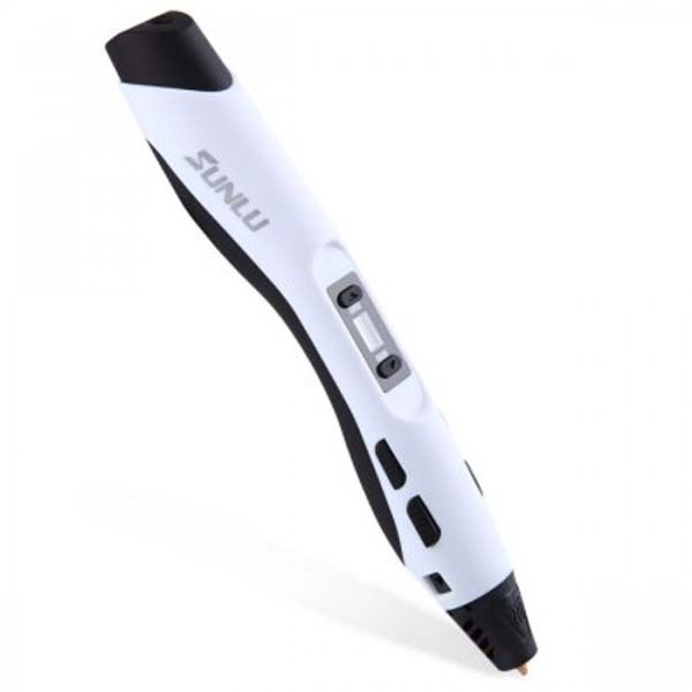&nbsp;&nbsp;
  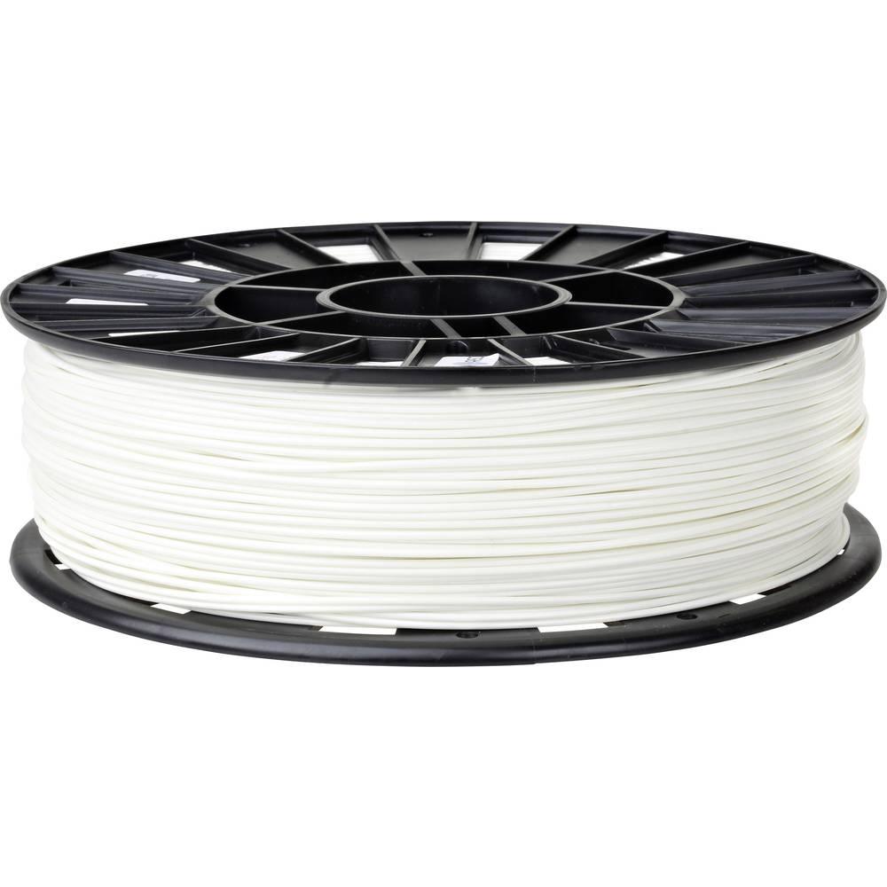&nbsp;&nbsp;&nbsp;&nbsp;
  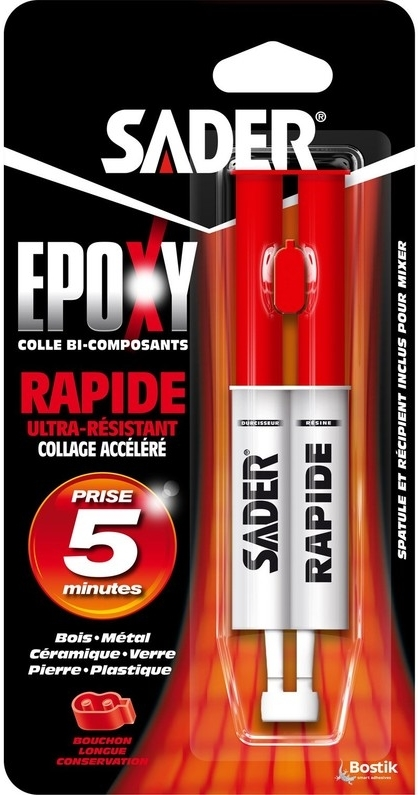

La prochaine étape est donc de corriger les erreurs d'impression en utilisant les mesures correctes du modèle 3D. Pour cela, j'utilise un décapeur thermique pour chauffer et redresser certaines parties du boitier. J'utile également un tube de colle Epoxy pour coller solidement certaines parties mal placées du boitier. J'utilise ensuite un stylo 3D accompagné d'un filament de PLA 1.75mm pour ajouter de la matière à certains endroits du boitier. Il ne me reste plus qu'à vérifier le bon emboitement et la fixation des composants à l'intérieur du boitier pour valider les corrections.

### Finitions

  &nbsp;&nbsp;
  &nbsp;&nbsp;
  

Les deux parties du boitier s'emboitent désormais parfaitement. Je m'attaque donc au plus vite aux finitions. Pour cela, j'utilise un Mastic de remplissage et de finitions automobiles pour combler les creux des surfaces. Il me suffit d'appliquer la pâte sur les surfaces, d'attendre le séchage complet puis de poncer à l'aide de papiers abrasifs de différents grains et de manière progressive. J'applique ensuite trois couches de peinture violette acrylique en spray avant d'appliquer deux couches de vernis mat en spray.
