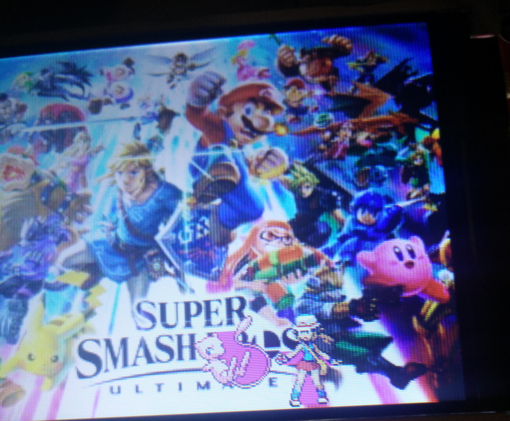
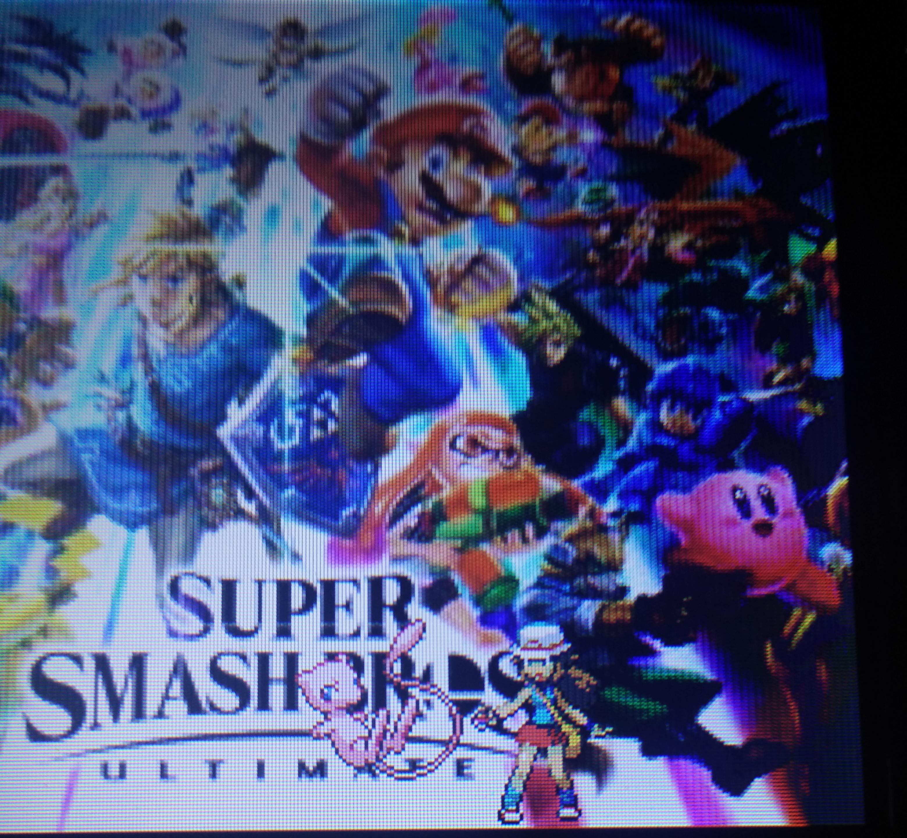
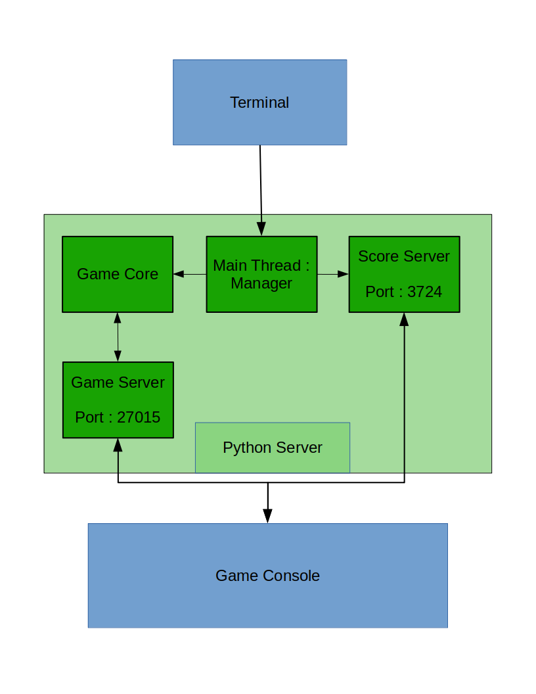

# PolyBoy Advance
## An Arduino Project
Notre projet est de créer une console portable basée sur Arduino Due. Elle sera notamment équipée d’un écran TFT, d’un lecteur de carte SD, d’un haut-parleur, d’un gyroscope, d’un module bluetooth… De plus, elle devrait posséder une interface permettant de lancer plusieurs jeux et applications.

### 14/12 : Séance 1
Après plusieurs recherches d'écrans :

1. **Un ili9486 3.5 inch** (8 pins de communications en parallèles)
2. **Un ili9341 3.2 inch** (16 pins de communications en parallèles)
3. **Un ili9341 3.2 inch** (communication en **SPI**)

On a décidé d'utiliser le **ili9341** en **SPI** qui était l'écran avec un rafraîchissement le plus rapide mais pas non plus suffisant. En cherchant plusieurs librairies qui n'accélérait pas le processus. On a trouve cette [librairie](https://github.com/marekburiak/ILI9341_due) avec une [video](https://www.youtube.com/watch?v=vnEwzN14BsU) montrant un mode du **SPI** plus rapide faite pour notre carte l'**Arduino Due**. Cette librairie accélère beaucoup le processus d'affichage et le met a un niveau suffisant pour faire des jeux. Cette librairie utilise le mode **DMA** ou Direct Memory Acess du **SPI** qui ne demande moins de ressource au micro-controller et permet l'exécution de code en parallele.

On arrive à afficher sur l'écran des formes géometriques et des images de toutes tailles. Le problème est d'afficher une image sur un **background**. On a reussi à afficher au maximum un **background** et un **sprite** dessus ([link](https://www.youtube.com/watch?v=tJE1cOGFOp4&feature=youtu.be)).
On a quand même un problème d'affichage liée au rafraichîssement de l'écran qui a pu être en partie reparé avec l'ajout d'un cap au **framerate** (nombre de fois que l'on finis un nouvelle frame en 1 seconde). On a donc bloqué le **framerate** à 60 **frame** par seconde. Le but maintenant est de faire que l'on ne rafraîchisse que la partie nécessaire de l'écran pour encore augmenter la vitesse et encore réduire les problèmes d'affichages.

### 18/12 : Séance 2

On a ajouté un **script** python pour convertir les images **bmp** en un **tableau** lisible par l'arduino. Ce **tableau** est à 1 dimension et contient les couleurs en valeur numérique codées en **RGB 565** (5 bits pour le rouge, 6 bits pour le vert et 5 bits pour le rouge). Cela nous permettra de facilement copier des images sur l'arduino et de les afficher. On a aussi travaillé sur la **gestion de l'affichage** de l'écran. Avant on redessiner complètement le **background** pour chaque nouvelle **frame** puis les **sprites** qui étaient au 1er plan. Cette méthode n'étant pas des plus rapide et ajoutant au problèmes que l'on puisse dessiner pendant que l'écran se rafraîchisse.  On a créé une **classe** sprite qui redessinera que les zones modifiées de l'écran, diminuant les données à envoyer entre l' **écran** et l'**arduino due**. On a cependant eu un problème avec notre **librairie**, la modification du bas de l'ecran, ne redessinait pas la bonne partie du **background** (elle dessinait le partie haute du background avec un decalage).  Le problème venant que la librairie codait l'**offset** sur **16bits** au lieu de **32bits** ce qui faisait que l'offset ne pouvait  pas atteindre les dernieres valeurs du background. On a ajouter des méthodes a la **librairie** pour résoudre ce problème en codant l'**offset** sur **32bits**.

Les problèmes persistant sont :

1. Le fait que l'on puisse dessiner pendant que l'écran se rafraîchisse (fait que le sprite se mélange au background)
2. On ne dispose pas de transparence sur l'ecran pour le moment

### 11/01 : Séance 3

Je me suis occupé du problème de transparence que l'on avait. Pour gerer la transparence je dois choisir une couleur qui sera consideré comme transparent la couleur utilisé communement est le **magenta** . Pour résoudre ce problème j'ai modifié notre **script** qui transfornait les images **bmp** en fichier pour l'arduino.A la place de copier tout l'image je regarde le contour du contenu de l'image et je prend que ce qu'il y a à l'interieur. Ce qui fait que les sprites n'auront pas forcément de forme carré. Cela ne gére que une partie de la transparence, cela permet d'enlever les fond noir de l'image mais laisse les pixel magenta à l'interieur du contour visible.

  

Pour résoudre ce problème on doit s'occuper du coté de l'arduino et plus spécifiquement du coté de la librairie. J'ai modifié la librairie en faisant que quand il affiche un **sprite** si la couleur est **magenta** il n'affiche pas **magenta** mais la couleur du **background** ce qui corrige le problème restant.

  

J'ai aussi commencé à travailler sur la partie wifi de notre projet j'ai réussi a envoyer un msg de l'**esp8266** à l'ordinateur sans plus.

### 11/01 : Séance 4

Je me suis occupé de la partie **serveur web** (Un serveur qui contiendra tout les meilleurs scores). On aura donc un autre ordinateur (possiblement un raspberry Pi) qui stockera toutes ces données et les modifira en fonction de ce que fera notre console.Notre console pourra donc pour chaque jeux recupérer les **High-scores** et aussi envoyer son score pour le rajouter au **High-Scores**. Le serveur que j'ai commencé a faire en python permet que d'envoyer le contenu de fichier a des client et a rajouter du contenu dans un fichier et vérifier si la communication a fonctionné.
Exemple de requetes :

**READ sokoban 1 10 23** : Demande le High-score des 10 premiers joueurs a sokoban(READ: type de requete, sokoban: le jeu en question, 1:debut du tableau, 10: fin du tableau, 23: nombre permettant de vérifier si la commu a réussi)

**WRITE sokoban Olivier 200 48** : Demande de rajouter au scores du jeu sokoban le joueurs Olivier avec un score de 200

Ce type de requete fonctionne pour le moment mais je compte les rendres plus précise (High-score par niveau la c'est défini par jeu).

### 06/02 : Séance 5

J'ai continué à travailler sur la partie serveur pour gérer la partie score des jeux. J'ai séparé la partie du code qui envoyait et modifiait les scores.J'en ai aussi profité pour le passer sous forme d'objet qui sera plus simple a modifer/gérer.Le code peut maintenant être executé sur un **thread**(indépendant du reste tourne en parallèle).J'ai aussi travaillé sur du code pour pouvoir modifier le serveur avec des commandes (Comme sur un terminal).

On a aussi dans l'idée de faire que la console(arduino) puisse jouer en **multijoueur** avec une autre console mais aussi pouvoir mettre ses scores sur le serveurs. J'ai donc aussi installé et commencé a utiliser **[VitaSDK](https://vitasdk.org/)** qui permet de développer sur Psvita. Cette console ayant tout se qui nous sera nécessaire.

1. Une connexion **Wifi** qui sera utilisé pour le multijoueur
2. Un portage d'une librairie **graphique** assez utilisé sur ordinateur(facilise les recherches et le portage vers Pc si nécessaire)

Pour l'instant sur la Psvita on peut afficher du text et des formes géometriques. On peut acceder au bouton de la console et la partie sans-fil. Notre code sur la console peut pour le moment afficher du text, envoyer une requete au serveur et afficher le contenu reçu.

### 13/02 : Séance 6

J'ai fait un schéma des différentes parties du la partie web de notre projet:

  

Les différentes parties sont :
1. **Score Server**: La partie qui recoit des requètes de modification ou de lecture de high-score
2. **Main Thread**: Permet de gerer les différentes partie du serveur (ex: les allumé ou non)
3. **Game Core**: La partie ou est calculé la physique du jeu
4. **Game Server**: La partie qui envoie le status du jeu et recoit les informations des consoles

Les parties **Score Server** et **Main Thread** sont terminé. J'ai aussi commencé a faire le traitement de la reception des requètes par l'**esp8266**.
